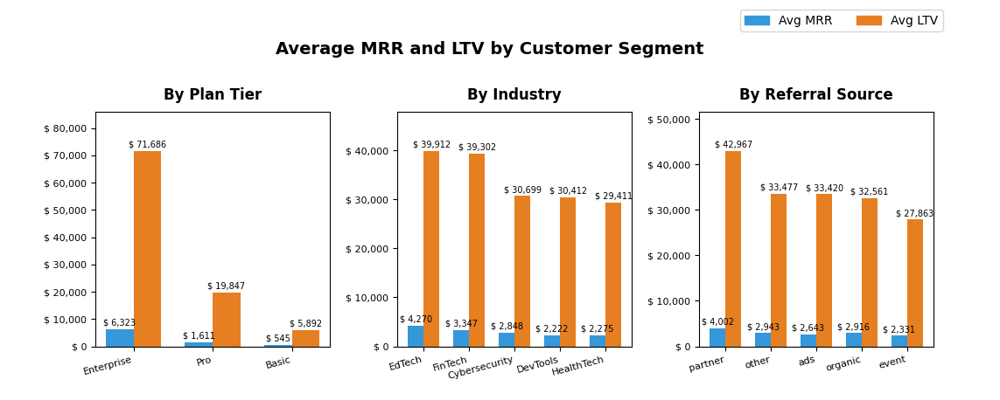
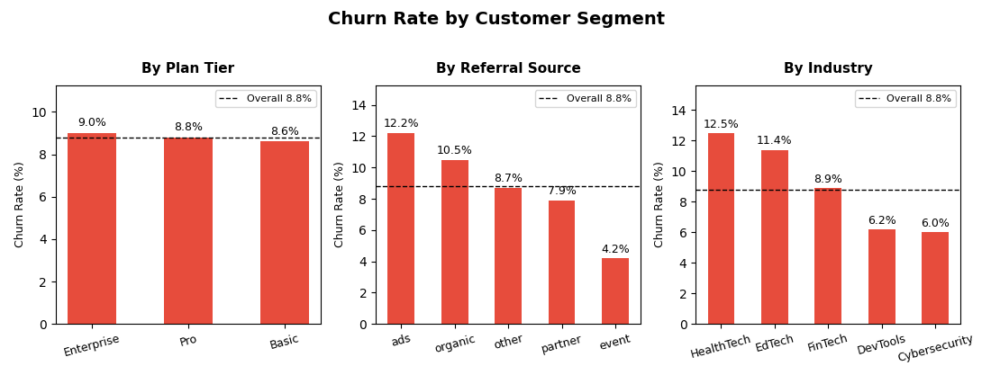
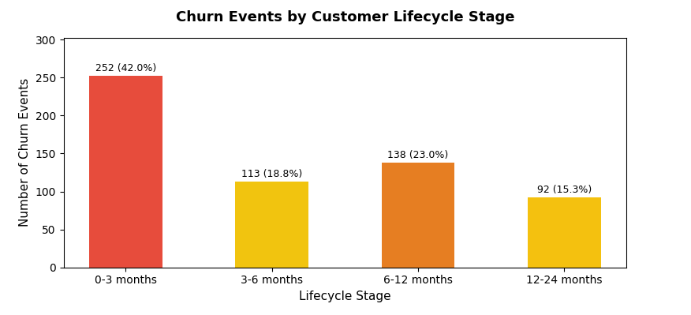
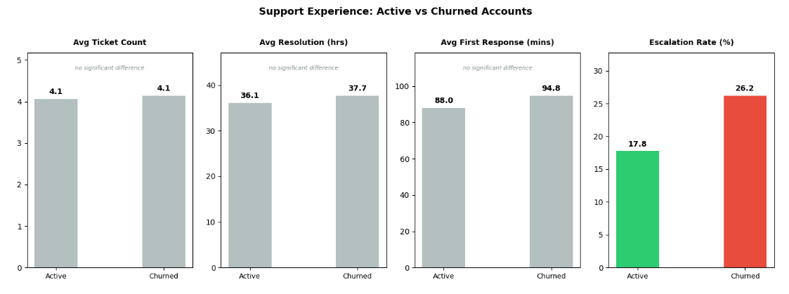
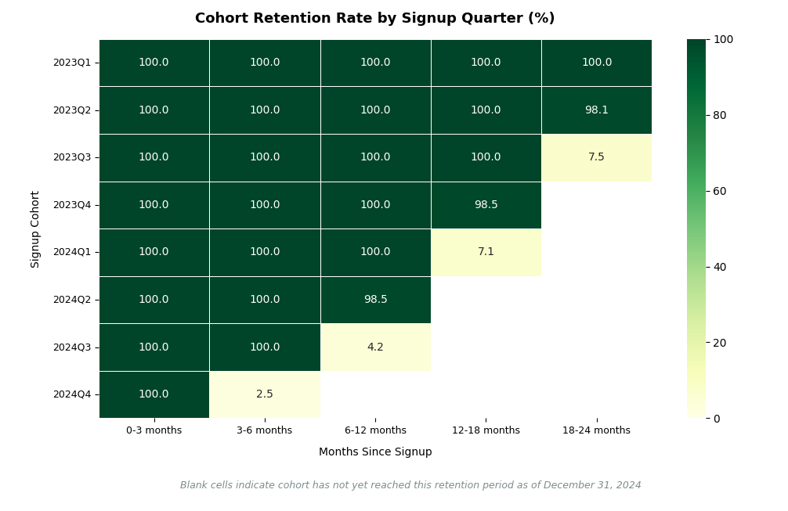

# RavenStack: SaaS Retention & Growth Analysis
### End-to-End Customer & Revenue Analysis in Python

**Analyst:** Elene Kikalishvili &nbsp;|&nbsp; **Language:** Python (pandas) &nbsp;|&nbsp; **Visualization:** matplotlib, seaborn &nbsp;|&nbsp; **Environment:** Jupyter Notebook  
**Last updated:** May 2026

---

## Table of Contents

- [Executive Summary](#executive-summary)
- [Business Problem](#business-problem)
- [Dataset](#dataset)
- [Methodology](#methodology)
- [Scope, Decisions & Limitations](#scope-decisions--limitations)
- [Technical Skills Demonstrated](#technical-skills-demonstrated)
- [Results & Recommendations](#results--recommendations)
- [Next Steps](#next-steps)
- [Repository Structure](#repository-structure)
- [How to Run](#how-to-run)
- [Contact](#contact)

---

## Executive Summary

RavenStack is a stealth-mode B2B SaaS startup preparing for public launch. After piloting its AI-powered collaboration and developer tools with 500 accounts across five industries, the business faces elevated churn and uneven revenue expansion - and needs to understand what drives long-term retention and revenue before its next board review.

This project delivers a full analytical report answering six business questions spanning revenue concentration, acquisition quality, customer lifecycle, support experience, product engagement, and cohort retention. Working across a fully relational five-table dataset, the analysis rebuilds churn logic from raw subscription records, validates every metric in code before it appears in commentary, and frames each finding for a named business stakeholder.

The analysis surfaces four decisions the business can act on: churn is concentrated in the first 90 days (42% of all churn), acquisition channel predicts churn more strongly than plan tier, support escalations are the clearest early-warning signal of churn, and revenue is heavily concentrated in a small number of high-value Enterprise accounts. Together these point to where RavenStack should focus retention investment as it scales.  

**Full analysis:** [`ravenstack_analysis.ipynb`](ravenstack_analysis.ipynb) &nbsp;|&nbsp; **Project scope:** [`SOW.md`](SOW.md)

> *This is a portfolio project built on a synthetic dataset. The business scenario is framed as real to demonstrate stakeholder-facing analytical work; data limitations are documented transparently in [Scope, Decisions & Limitations](#scope-decisions--limitations).*  

---

## Business Problem

Despite steady account growth, RavenStack faces two connected problems ahead of public launch: **elevated churn** and **uneven revenue expansion across segments**. With limited resources and a public launch approaching, leadership needs to know where retention risk concentrates, which customers drive value, and which signals predict churn early enough to act on.

The data team was asked to answer six business questions:

| # | Question | Theme | Stakeholder |
|---|---|---|---|
| Q1 | Which customer segments generate the highest revenue and long-term value? | Revenue | CFO & Head of Sales |
| Q2 | Which segments show the highest churn rates, and what does this reveal about acquisition quality? | Acquisition Quality | Head of Customer Success & Growth |
| Q3 | What does the journey from trial → upgrade → churn look like, and where does revenue collapse? | Lifecycle | CEO |
| Q4 | Which features drive engagement, and how are beta features adopted across segments? | Product | Product Team |
| Q5 | Which support experience patterns are associated with increased churn risk? | Support | Head of Customer Success |
| Q6 | How do different signup cohorts retain over time? | Retention | Board & Head of Customer Success |

---

## Dataset

**Source:** RavenStack Synthetic SaaS Dataset - River @ Rivalytics (Kaggle)
**Format:** 5 relational CSV files with full primary/foreign key integrity

| Table | Rows | Description |
|---|---|---|
| `accounts` | 500 | Master customer records - primary table linked by all others |
| `subscriptions` | 5,000 | Subscription lifecycle records including MRR, ARR, and plan changes |
| `feature_usage` | 25,000 | Product interaction logs across 40 features |
| `support_tickets` | 2,000 | Support activity with satisfaction scores and resolution metrics |
| `churn_events` | 600 | Historical churn log with reason codes and reactivation flags |

**Relationships:**
- `subscriptions.account_id` → `accounts.account_id`
- `feature_usage.subscription_id` → `subscriptions.subscription_id`
- `support_tickets.account_id` → `accounts.account_id`
- `churn_events.account_id` → `accounts.account_id`

Full schema and column-level definitions are documented in [`data/DATASET.md`](data/DATASET.md).

---

## Methodology

The analysis was conducted entirely in Python (pandas, matplotlib, seaborn) within a Jupyter Notebook, structured as a professional stakeholder report.

**1. Data understanding & preparation.** Structured exploration of all five tables - structure, numeric distributions, categorical breakdowns, and referential integrity - followed by date conversion, null handling, duplicate investigation, and data type verification.

**2. Definition & validation.** All metrics and business logic were defined up front (active MRR, churn, LTV, engagement score, support burden), table relationships mapped, and a validation-first workflow adopted: every figure was confirmed in code before being referenced in any commentary.

**3. Executive KPI snapshot.** Dedicated validation cells confirmed the churn definition, date ranges, and trial records before any headline number was reported, producing five validated KPIs.

**4. Six business analyses.** Each question was built on a purpose-specific dataframe, validated before use, framed for a named stakeholder, and closed with a key findings summary. A central principle was *validate before claiming* - no number entered the narrative without being computed first.

**5. Final synthesis.** Cross-question analytical findings and prioritized, stakeholder-addressed recommendations.

---

## Scope, Decisions & Limitations

This project uses a **fully synthetic dataset**. It is relationally complete and realistic in structure, but its values were generated largely independently of one another, which shaped several analytical decisions. A core principle of the project was to revise scope and document the reasoning when the data did not support a planned analysis, rather than present misleading results.

**Re-scoping decisions**

- **Expansion behavior (Q1) - excluded.** Upgrade and downgrade flags are unreliable, and expansion derived directly from subscription history showed perfectly balanced upgrade/downgrade rates (33.2% each) with unrealistic back-and-forth plan movements. Net expansion was excluded as not analytically meaningful.
- **Trial-to-paid conversion (Q2) - re-scoped.** The dataset shows 100% trial-to-paid conversion across all channels - a synthetic artifact. Q2 was redirected to focus on customer value and churn risk by acquisition channel.
- **Top-feature engagement chart (Q4) - dropped.** Average engagement across all 40 features ranged only from 9.80 to 10.35 (a spread of 0.55), too uniform to visualize meaningfully. The aggregation was kept to document the work; the chart was replaced with an honest written finding.

**Data limitations**

- **Flat distributions.** Beta adoption, feature engagement, the engagement score, and support burden by plan tier showed little meaningful variation between segments - consistent with random generation. These are reported as flat rather than overstated.
- **Engagement score shows no churn separation.** The composite score was near-identical for active (0.454) and churned (0.449) accounts, because usage was generated independently of churn. In production, declining engagement is typically a strong churn predictor.
- **Abrupt cohort curves.** Some cohorts drop sharply rather than decaying gradually. The cohort *methodology* - quarterly grouping with right-censoring of immature cells - is the transferable skill demonstrated.
- **Unreliable status flags.** The `churn_flag`, `upgrade_flag`, and `downgrade_flag` fields are inconsistent and were not used as authoritative; churn and expansion logic were rebuilt from subscription records instead.

The value of this project lies in the analytical process - relational modeling, validation discipline, metric construction, and honest handling of limitations - rather than in the specific values produced by synthetic data.

---

## Technical Skills Demonstrated

**Data Preparation & Validation**
- Multi-table relational merging across five tables using account and subscription keys
- Data quality investigation - identified, documented, and resolved multiple distinct data quality issues
- Validation-first workflow: every metric confirmed in code before use in narrative

**Analytical Techniques**
- Subscription-based churn definition built from scratch rather than relying on unreliable flags
- Customer LTV calculation (MRR × tenure)
- Min-max normalization and weighted composite metric construction (engagement score)
- Cohort retention analysis with right-censoring logic to mask statistically immature cells
- Lifecycle-stage segmentation and churn reason analysis

**Visualization & Communication**
- matplotlib and seaborn for segmented bar charts, distribution comparisons, and a cohort retention heatmap
- Deliberate chart design - de-emphasizing non-significant comparisons, masking censored data, annotating for non-technical readers
- Stakeholder-framed reporting structure throughout

---

## Results & Recommendations

### Revenue is concentrated in Enterprise

RavenStack's active MRR is **USD 10,159,608** across 500 accounts. Enterprise carries by far the highest customer lifetime value - USD 71,686 average versus USD 19,847 for Pro and USD 5,892 for Basic. A small number of high-value accounts drive the business.



> **Recommendation:** Build a dedicated Enterprise retention programme. Enterprise drives a disproportionate share of both revenue and churned MRR, making it the single highest-impact revenue-protection lever.

### Acquisition channel predicts churn better than plan tier

Paid ads produce the highest-churn customers at **12.2%**, followed by organic search at **10.5%**, while partner and event channels retain best. Churn across plan tiers is nearly identical (9.0% / 8.8% / 8.6%) - retention risk is driven by *how* a customer was acquired, not *what* they pay.



> **Recommendation:** Evaluate acquisition channels by retention quality, not just volume. Shift budget toward partner and event channels; review paid ad spend, which produces the highest-churn customers.

### Churn is an early-lifecycle problem

**42% of all churn occurs within the first 3 months** - the highest-risk window in the customer journey. A secondary concentration in months 6-12 (23%) marks a second at-risk window. RavenStack loses an estimated **USD 1,442,088 in MRR to churn - 12.4% of total potential revenue.**



> **Recommendations:** Invest in first-90-day onboarding to address the primary churn window, and add a 6-month re-engagement check-in to address the secondary one. Position Pro as the default entry point - Pro starters churn at 5.5% versus ~10.5% for other tiers.

### Escalations are the clearest churn signal

Of five support metrics compared between churned and active accounts, **escalation is the only one that meaningfully separates them**: churned accounts escalate at **26.2%** versus **17.8%** for active accounts. Ticket count, resolution time, response time, and satisfaction score show no meaningful difference.



> **Recommendation:** Treat an escalated ticket as a churn-risk trigger - route any escalation to proactive Customer Success outreach within 24 hours.

### Beta adoption is universal across all segments

Beta feature adoption is near-universal at **98.4%** across all 500 accounts, with no meaningful variation by plan tier or industry. There is no resistant segment - a positive signal for general availability rollouts ahead of public launch.

> **Recommendation:** Proceed with beta feature general availability. Adoption is broad and shows no segment friction.

### Earliest cohorts retain best

RavenStack's earliest signup cohorts retain most strongly - 2023Q1 retains 100% of accounts through 18-24 months, and 2023Q2 retains 98.1% at the same milestone. As acquisition scales across new channels and industries ahead of public launch, maintaining this retention quality is the defining retention challenge.



> **Recommendation:** Monitor whether newer signup cohorts retain as well as the early pilot cohorts as acquisition scales - early cohort retention should not be assumed to carry forward.

---

## Next Steps

With additional time, data, or a production dataset, this analysis could extend to:

- **Churn prediction modeling** - using subscription, support, and engagement features to score account-level churn risk, rather than describing churn after the fact
- **Real behavioral engagement scoring** - rebuilding the engagement score on production usage data, where it would carry genuine predictive signal
- **Acquisition channel ROI** - joining acquisition cost data to retention to calculate true LTV:CAC by channel
- **Expansion revenue analysis** - revisiting upgrade/downgrade behavior on clean data to quantify net revenue retention
- **Time-series cohort tracking** - extending cohort retention beyond the dataset window to observe full retention curves as they mature

---

## Repository Structure

```
saas-retention-growth-analysis/
│
├── data/                          ← 5 relational CSV files
│   └── DATASET.md                 ← Dataset documentation & schema (River @ Rivalytics)
│
├── images/                        ← Chart exports used in this README
│   ├── cohort_retention_heatmap.png
│   ├── churn_by_lifecycle_stage.png
│   ├── churn_rate_by_segment.png
│   ├── mrr_ltv_by_segment.png
│   └── support_experience_comparison.png
│
├── ravenstack_analysis.ipynb      ← Full analysis notebook
├── SOW.md                         ← Statement of Work (scope, metrics, assumptions)
├── README.md                      ← This file
├── LICENSE
└── .gitignore
```

---

## How to Run

### Prerequisites
- Python 3.9+
- Jupyter Notebook or JupyterLab
- pandas, numpy, matplotlib, seaborn

### Step 1 - Clone the repository
```bash
git clone https://github.com/EleneKikalishvili/saas-retention-growth-analysis.git
cd saas-retention-growth-analysis
```

### Step 2 - Install dependencies
```bash
pip install pandas numpy matplotlib seaborn jupyter
```

### Step 3 - Launch the notebook
```bash
jupyter notebook ravenstack_analysis.ipynb
```

Then run all cells from top to bottom (**Kernel → Restart & Run All**). The notebook expects the five CSV files in the `data/` directory.

---

## Contact

**Elene Kikalishvili**
[LinkedIn](https://www.linkedin.com/in/elene-kikalishvili/) &nbsp;|&nbsp; [GitHub](https://github.com/EleneKikalishvili)

---

*Dataset: RavenStack Synthetic SaaS Dataset by River @ Rivalytics. Fully synthetic - no PII. Used for educational and portfolio purposes with credit to the original author.*
*Analysis period: January 2023 – December 31, 2024.*
